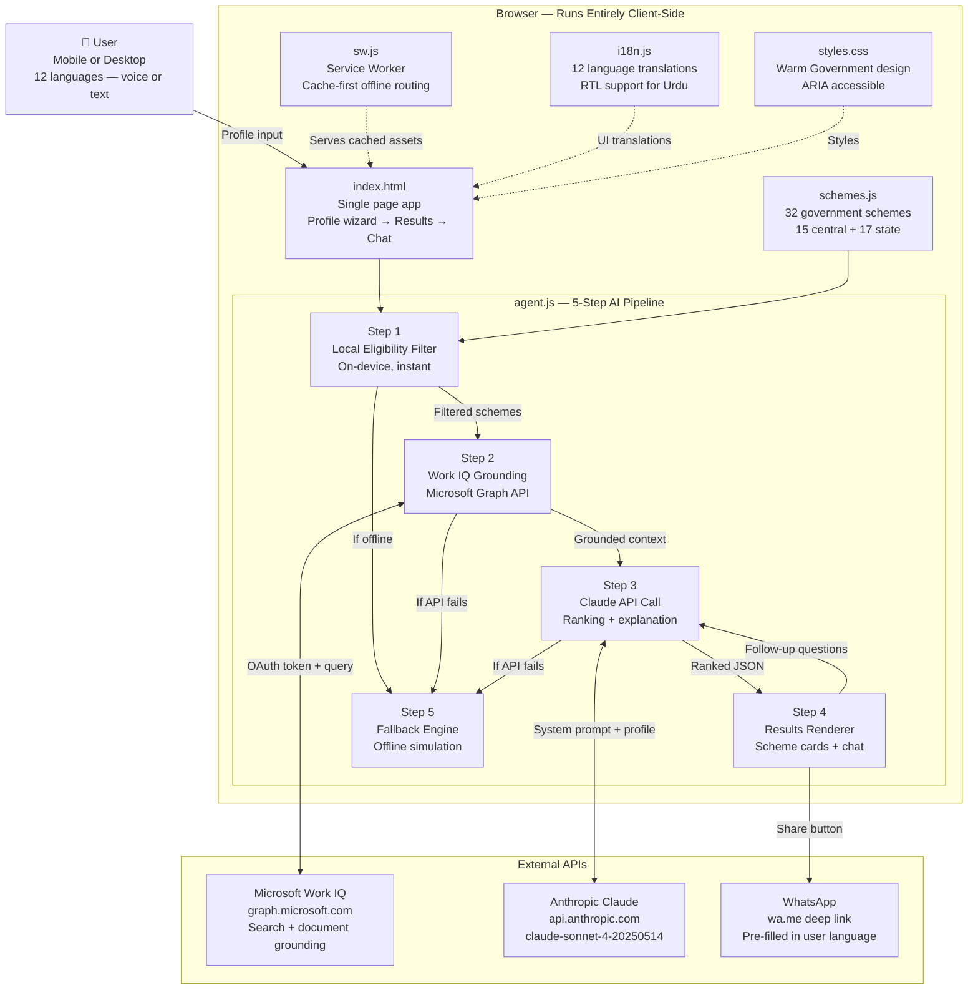

# SchemeSaathi — Architecture

## System Overview

SchemeSaathi is a client-side Progressive Web Application.
There is no backend server. All logic runs in the browser.
The only external calls are to:
- Microsoft Graph API (Work IQ grounding)
- Anthropic Claude API (AI reasoning)
Both calls fail gracefully with a local fallback.

## Full Architecture Diagram



## Data Flow — Single User Journey

```
1. User opens app (served from cache if offline — sw.js)
2. User selects language (i18n.js loads translations)
3. User fills profile form — voice or text input
4. "Find my schemes" button pressed
5. Step 1: filterSchemesByProfile() runs locally against schemes.js
   → Returns N eligible schemes in ~10ms
6. Step 2: groundWithWorkIQ() calls Microsoft Graph Search
   → Returns official document summaries for grounding context
   → On failure: returns { groundingSource: "local_fallback" }
7. Step 3: explainWithClaude() sends profile + filtered schemes
   + grounding context to Claude API
   → Returns ranked JSON with urgency, explanation, action steps
   → On failure: buildFallbackResponse() runs locally
8. Step 4: Results rendered as scheme cards
   → Each card shows: urgency badge, benefit amount, why you qualify,
     documents needed, official website link, WhatsApp share button
9. Follow-up chat: answerFollowUp() handles questions using Claude
   → On failure: keyword-based local responses from i18n.js
```

## File Dependency Map

```
index.html
  ├── styles.css
  ├── schemes.js        (loaded first — no dependencies)
  ├── i18n.js           (loaded second — no dependencies)
  └── agent.js          (loaded last — depends on schemes.js, i18n.js)

sw.js                   (registered by index.html — independent)
manifest.json           (referenced by index.html — independent)
```

## Security Notes

- No user data is stored on any server
- Profile data lives only in browser memory (cleared on page close)
- API keys are entered by the user and stored in localStorage only
- No analytics, no tracking, no cookies
- All external API calls use HTTPS
- Work IQ token scoped to read-only: Files.Read, Sites.Read.All
