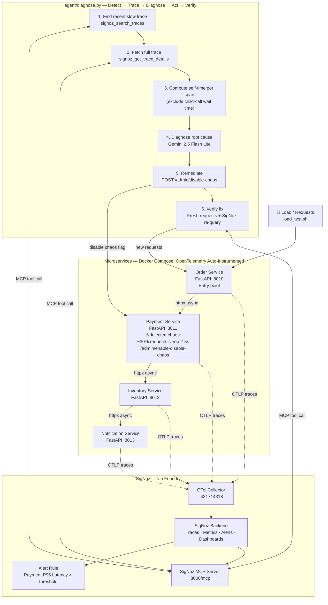

# Distributed Cascade Detective — Architecture

## System Overview

A distributed system of 4 chained microservices, fully instrumented with
OpenTelemetry, monitored by SigNoz. An AI agent uses the SigNoz MCP server
to detect a cascading failure, correctly diagnose the true root cause (not
just the symptom), fix it, and verify the fix actually worked.

## Full Architecture Diagram



## Data Flow — Single Cascade Detection Cycle

```
1. load_test.sh sends 20 requests to Order Service
2. Order → Payment → Inventory → Notification, each hop traced via OTel
3. ~30% of requests hit Payment's injected chaos (2-5s random delay)
   → Order and downstream calls appear slow too, but only because they wait
4. SigNoz alert fires when Payment's P95 latency crosses threshold
5. agent/diagnose.py runs:
   a. Query SigNoz MCP for a recent trace with duration > 2s
   b. Fetch all spans in that trace across all 4 services
   c. Compute each span's self-time (duration minus time spent in children)
   d. Send span + self-time data to Gemini — asked to find the span with
      the highest self-time, not just the longest total duration
   e. Gemini correctly identifies Payment Service as root cause
   f. Agent calls Payment's /admin/disable-chaos endpoint
   g. Agent sends 10 fresh requests and times them directly
   h. Agent re-queries SigNoz for Payment's P95 latency
   i. Both measurements confirm recovery: ~48ms avg (vs. 2000-5000ms before)
```

## Why self-time, not total duration

A cascading failure makes every upstream service *look* slow, because each
one is blocked waiting on the next. Total span duration alone can't tell
you which service is actually doing slow work versus which is just
waiting. Self-time (a span's own duration minus the combined duration of
its child spans) isolates the real bottleneck — this is the core technical
mechanism that makes root-cause diagnosis reliable instead of guesswork.

## Security / Scope Notes

- No production secrets in the repo — `GEMINI_API_KEY` and `SIGNOZ_API_KEY`
  are loaded from a local `.env` file (gitignored); `.env.example` shows
  the required shape.
- SigNoz MCP server requires an authenticated Service Account API key,
  not the personal login used for the SigNoz UI.
- The remediation action is intentionally scoped to one failure mode on
  one service (Payment), not a general-purpose auto-healing engine —
  see README's "Known limitations" section.
