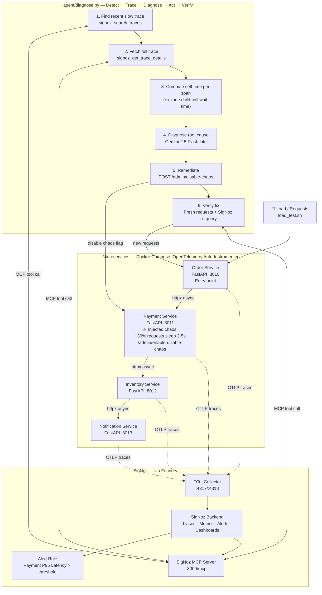

## 🕵️ Distributed Cascade Detective

An AI agent that detects a cascading failure across a distributed system, correctly
identifies the *true* root cause (not just the symptom), fixes it, and verifies the
fix worked - all using SigNoz for observability and diagnosis.

## 🎯 Why this is different from a typical "self-healing bot"

Most single-service alert-and-fix demos react to one alert on one service. This
project instruments **4 chained microservices** with full OpenTelemetry distributed
tracing, so a single request produces **one connected trace across all 4 services**.
When a failure cascades (one slow service makes everything upstream *look* slow too),
the agent has to correctly tell the difference between a service that's actually slow
and one that's just waiting , using **self-time analysis** on real span data, not just
"which service has the longest span."

## 🏗️ Architecture

```
Order Service → Payment Service → Inventory Service → Notification Service
   (:8010)          (:8011)            (:8012)              (:8013)
```

## Full Architecture Diagram



## Data Flow — Single Cascade Detection Cycle

```
1. load_test.sh sends 20 requests to Order Service
2. Order → Payment → Inventory → Notification, each hop traced via OTel
3. ~30% of requests hit Payment's injected chaos (2-5s random delay)
   → Order and downstream calls appear slow too, but only because they wait
4. SigNoz alert fires when Payment's P95 latency crosses threshold
5. agent/diagnose.py runs:
   a. Query SigNoz MCP for a recent trace with duration > 2s
   b. Fetch all spans in that trace across all 4 services
   c. Compute each span's self-time (duration minus time spent in children)
   d. Send span + self-time data to Gemini — asked to find the span with
      the highest self-time, not just the longest total duration
   e. Gemini correctly identifies Payment Service as root cause
   f. Agent calls Payment's /admin/disable-chaos endpoint
   g. Agent sends 10 fresh requests and times them directly
   h. Agent re-queries SigNoz for Payment's P95 latency
   i. Both measurements confirm recovery: ~48ms avg (vs. 2000-5000ms before)
```

- Each service is a small FastAPI app instrumented with OpenTelemetry
  auto-instrumentation (`opentelemetry-instrument`), exporting traces to SigNoz via OTLP.
- Payment Service has a togglable injected failure (`/admin/enable-chaos` and
  `/admin/disable-chaos`): ~30% of requests hit a random 2-5s artificial delay,
  simulating a flaky downstream dependency.
- A SigNoz alert fires on Payment Service's P95 latency.
- An agent script (`agent/diagnose.py`) uses the **SigNoz MCP server** to:
  1. Find a recent slow trace on the entry-point service
  2. Fetch full trace details (all spans across all 4 services)
  3. Compute each span's **self-time** (its own execution time, excluding
     time spent waiting on downstream/child calls)
  4. Send the span + self-time data to **Gemini 2.5 Flash Lite** to diagnose
     the true root cause
  5. Call the root-cause service's remediation endpoint to disable the fault
  6. Send fresh requests and re-query SigNoz to **verify the fix actually worked**

## 🛠️ Tech stack (all free tier)

- **FastAPI** + **httpx** — microservices and inter-service async calls
- **OpenTelemetry Python SDK** — distributed tracing, auto-instrumented
- **SigNoz** (via Foundry) — traces, metrics, alerts, dashboards
- **SigNoz MCP server** — how the agent queries live telemetry
- **Gemini 2.5 Flash Lite** (free tier) — root-cause reasoning
- **Docker Compose** — orchestration
- **GitHub Copilot** — in-editor code generation
- **Claude** — architecture planning and debugging

## 🤖 AI tool disclosure

This project was built with AI assistance throughout: GitHub Copilot for in-editor
code generation, and Claude for architecture planning, debugging, and iterative
problem-solving during development. Gemini 2.5 Flash Lite is also a functional part
of the running system itself (the diagnosis engine), not just a dev tool.

## 🚀 Running it

**Prerequisites:** Docker, Docker Compose, Python 3.10+, a SigNoz deployment (via
Foundry — see `casting.yaml`), a free Gemini API key.

1. Reproduce the SigNoz deployment: `foundryctl apply -f casting.yaml`
   (requires `casting.yaml.lock` in the same directory)
2. Set up environment variables in `.env` (see `.env.example`):
   ```
   GEMINI_API_KEY=your_key_here
   SIGNOZ_API_KEY=your_signoz_service_account_key_here
   ```
3. Build and start the microservices:
   ```
   docker compose up --build
   ```
4. Generate load (some requests will be slow due to injected chaos):
   ```
   ./load_test.sh
   ```
5. Run the agent to detect, diagnose, fix, and verify:
   ```
   cd agent
   pip install -r requirements.txt --break-system-packages
   python3 diagnose.py
   ```

## 📊 What's demonstrated in SigNoz

- Distributed traces spanning all 4 services with correct context propagation
- A metric/trace-based alert ("Payment Service High Latency") firing on P95 latency
- Live querying of trace data via the SigNoz MCP server from an external agent

## Known limitations / scope

This is a hackathon-scale proof of concept: one failure mode, one remediation
action (disable a feature flag / fix endpoint), hardcoded to Payment Service.
The diagnosis logic generalizes to any service in the trace (it doesn't assume
Payment is the answer), but the remediation step is intentionally scoped rather
than a general-purpose auto-healing engine, which would be out of scope for the
time available.
